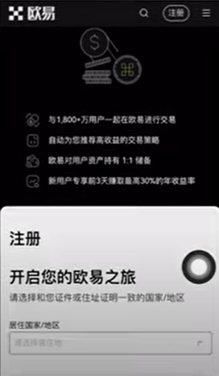
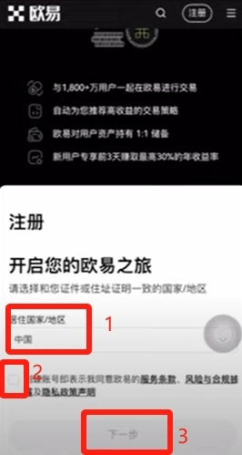
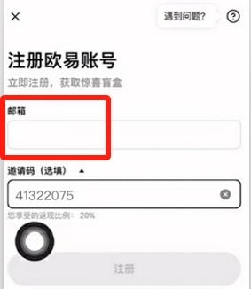
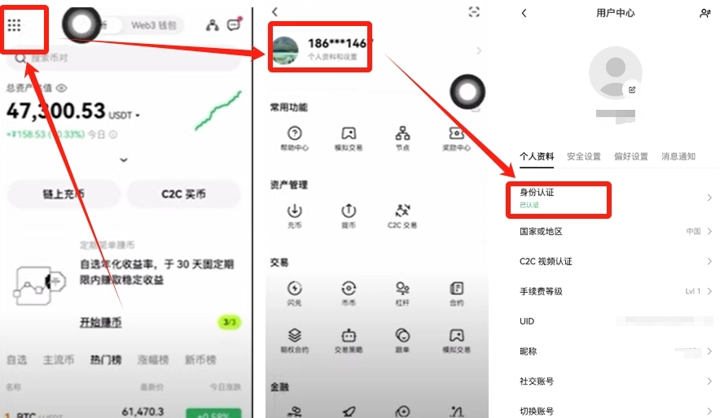
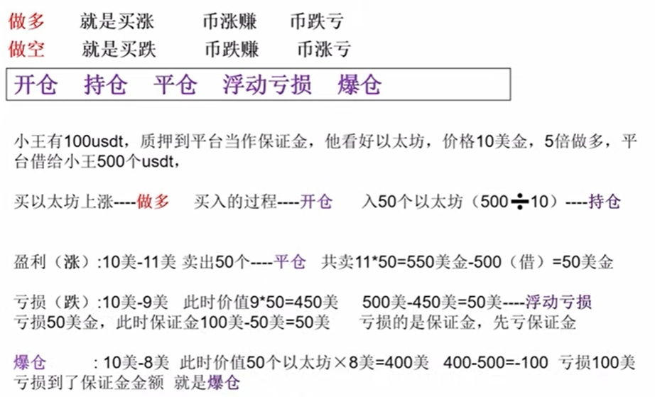
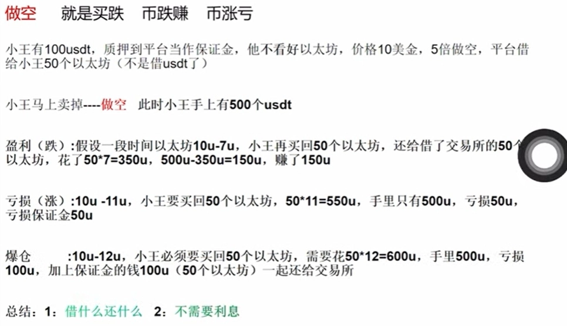

# OKX合约交易完整操作指南：新手从零上手做多做空

---

交易所合约交易让很多人望而生畏——杠杆、保证金、爆仓这些词听起来就很复杂。但说白了，合约就是个放大器：币价涨10%，你开5倍杠杆就能赚50%；反过来，跌10%你也亏50%。这篇文章会用最直白的方式告诉你：合约到底怎么玩，钱怎么赚，又怎么会亏光。看完你就能明白，为什么有人靠合约翻倍，也有人一夜爆仓。

---

## 一、先搞定交易所账户

合约交易需要在交易所进行。这里推荐OKX（欧易交易所），老牌平台，合约功能齐全，新手友好。

**注册流程：**

1. 👉 [点击这里注册OKX账户，使用邀请码62834398享手续费优惠](https://www.okx.com/join/62834398)
2. 复制链接到手机自带浏览器或Chrome打开
3. 选择你所在的国家/地区

4. 输入邮箱，按提示完成注册

**下载APP：**

- **安卓用户**：注册后页面会直接出现下载按钮，点击即可
- **苹果用户**：需要用非中国区Apple ID登录App Store，搜索"OKX"下载（某宝或某度可购买海外ID）

**关键步骤：实名认证**

登录APP后，点击左上角九宫格 → 个人设置 → 完成实名认证。不认证无法交易。

---

## 二、合约交易到底是什么？

合约交易就两个方向：**做多（买涨）**和**做空（买跌）**。

### 做多：押注币价会涨

**案例：小王的5倍做多**

小王有100 USDT，他看好以太坊会涨，决定5倍做多。

1. **开仓**：他把100 USDT抵押给平台当保证金，平台借给他500 USDT，他用这500 USDT买了50个以太坊（假设价格10美元/个）
2. **持仓**：此时小王持有50个以太坊，等待价格变化
3. **盈利情况**：
   - 以太坊涨到11美元 → 他卖出50个 = 550 USDT
   - 还给平台500 USDT → 净赚50 USDT（收益率50%）
4. **亏损情况**：
   - 以太坊跌到9美元 → 50个币只值450 USDT
   - 还不上平台的500 USDT，亏损50 USDT从保证金扣除
5. **爆仓**：
   - 以太坊跌到8美元 → 50个币只值400 USDT
   - 亏损100 USDT = 保证金全没了 → 触发爆仓，强制平仓

**核心逻辑**：做多借的是钱（USDT），还的也是钱。币价涨了你赚差价，跌了就亏保证金。

---

### 做空：押注币价会跌

**案例：小王的5倍做空**

小王有100 USDT，他觉得以太坊会跌，决定5倍做空。

1. **开仓**：他把100 USDT抵押给平台，平台借给他50个以太坊（价格10美元/个）
2. **立即卖出**：小王马上把50个以太坊卖掉，换成500 USDT拿在手里
3. **盈利情况**：
   - 以太坊跌到7美元 → 他用350 USDT买回50个以太坊
   - 还给平台50个币，手里剩150 USDT → 净赚150 USDT
4. **亏损情况**：
   - 以太坊涨到11美元 → 需要550 USDT才能买回50个币
   - 手里只有500 USDT，亏损50 USDT从保证金扣除
5. **爆仓**：
   - 以太坊涨到12美元 → 需要600 USDT买回50个币
   - 手里只有500 USDT，亏损100 USDT = 保证金全没 → 爆仓

**核心逻辑**：做空借的是币，还的也是币。币价跌了你赚差价，涨了就亏保证金。

---

## 三、合约交易的铁律

**记住两条：**

1. **借什么还什么**：做多借USDT还USDT，做空借币还币
2. **杠杆是双刃剑**：5倍杠杆意味着收益和亏损都放大5倍，币价波动20%你就爆仓

---

## 总结

合约交易本质上是用杠杆放大你的判断——判断对了赚得快，判断错了亏得也快。新手建议从低倍杠杆（2-3倍）开始练手，先搞懂开仓、平仓、止损的逻辑再加仓位。如果你想体验合约交易，👉 [注册OKX使用邀请码62834398](https://www.okx.com/join/62834398)，平台提供模拟盘功能，可以零风险熟悉操作流程。记住：合约不是赌博，但也绝不是稳赚不赔的生意。控制仓位，设好止损，永远是第一要务。
